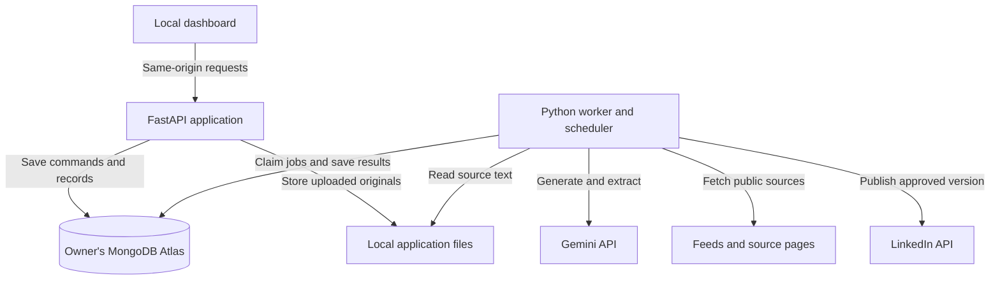
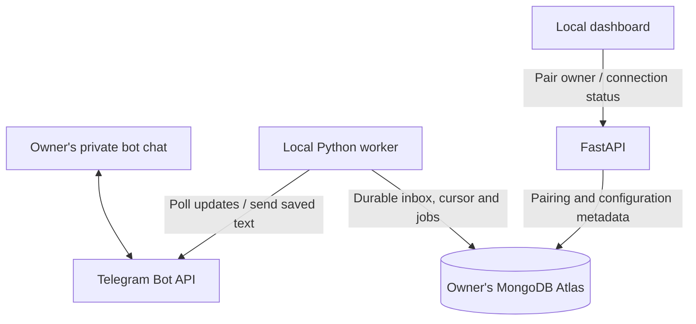
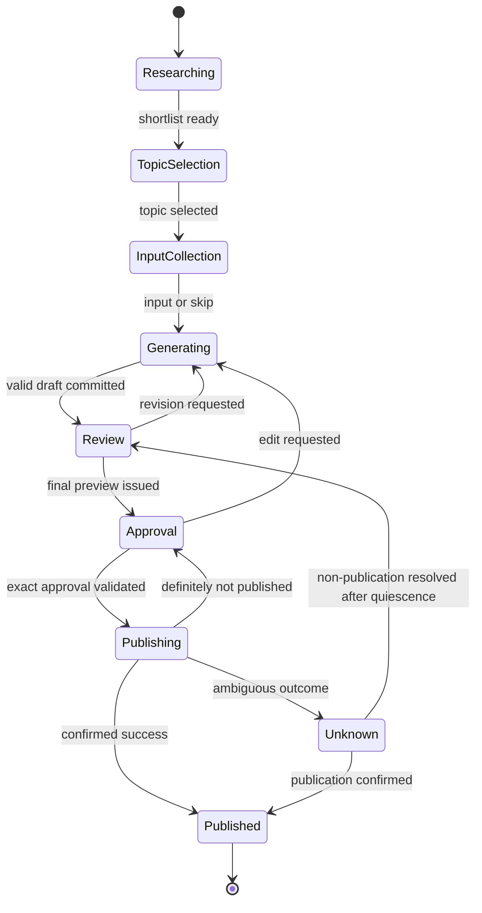
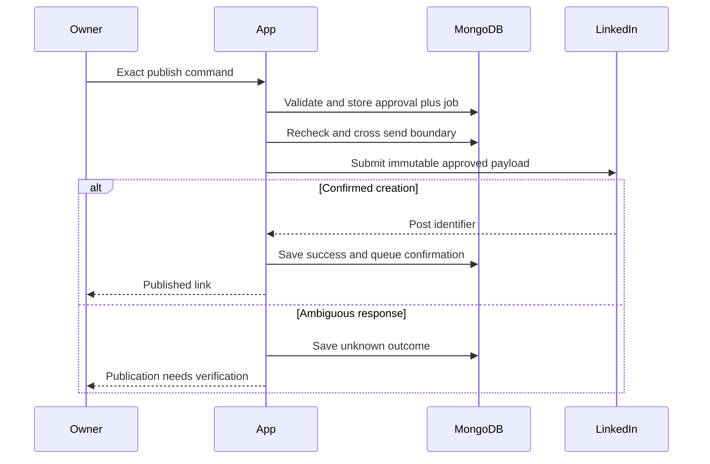

# Weekly LinkedIn Post Agent — V1
# System Architecture and Detailed Design

**Document version:** 1.4<br>
**Date:** 2 October 2026<br>
**Baseline:** `docs/PRD_final.md`, revision 1.4<br>
**Audience:** Codex, coding agents, and the application owner<br>
**Status:** Single-installation implementation baseline; gate status is tracked in `docs/integration-validation.md`
**Revision scope:** Aligns with PRD 1.4: the 1.3 single-owner and Telegram baseline plus portable professional knowledge exports. Historical revision notes remain below.
**Review verdict:** Proceed with validation and implementation on the owner installation. Gate evidence is tracked separately.

## 1. Purpose, authority, and decisions

This document translates PRD 1.4 into an implementable design. It does not add a new product release or expand its 14 feature IDs. If this document conflicts with the PRD, preserve the PRD's product behavior and flag the conflict. Values labelled “design default” resolve implementation details; they are not provider guarantees.

Build one single-owner application on the owner’s computer. Share source code and placeholder configuration only. The owner supplies one configured MongoDB connection, Gemini key, LinkedIn authorisation, and Telegram bot/token. There is no central backend, user directory, tenant selector, or shared research cache.

### 1.0 Revision 1.4 reading guide

This is a complete revised architecture, not a separate review memo. Changes are integrated into their owning sections. Section 22 provides a change register and an implementation checklist for coding agents.

The PRD remains the product authority. This revision preserves its 14 feature IDs and adds the agreed F04 knowledge portability behavior. The current PRD 1.4 was read for this revision. Its Telegram decision supersedes all earlier WhatsApp, self-chat, and shared-number assumptions. Live integration evidence is recorded in `docs/integration-validation.md`. This document replaces architecture revision 1.3 as the implementation baseline.

No new product decision is required to start phase 0. Values labelled design defaults can be tuned without weakening the invariants. Do not turn an unpassed gate into an assumed capability.

### 1.1 Selected architecture

- **Backend:** Python 3.12, FastAPI, Pydantic, and Uvicorn.
- **Frontend:** React, TypeScript, and Vite. FastAPI serves the compiled dashboard during normal use.
- **Database:** MongoDB Atlas Free, using the owner’s configured cluster and database; PyMongo Async for access.
- **AI:** Gemini API through the `google-genai` Python SDK; model identifier supplied through configuration.
- **Messaging:** Official Telegram Bot API directly from the Python worker; one owner-controlled bot/token and one local long-polling receiver, conditional on G1 validation.
- **Workflow:** Explicit Python state transitions persisted in MongoDB.
- **Background execution:** One local worker with MongoDB-backed jobs, leases, and an outgoing-message queue.
- **Research:** Public feeds, release notes, accessible source pages, and user-provided URLs. No paid search dependency.
- **Publishing:** Official LinkedIn member-post API with OAuth, conditional on gate G2.
- **Storage:** Original uploads and operational recovery files on the local filesystem; product records in the owner's MongoDB database.

Use Node.js 22 as the initial frontend development target. Messaging runs in Python and adds no Node gateway process. Lock dependency versions after the integration prototype; do not use floating `latest` versions in reproducible builds. Official provider interfaces are referenced in section 21.

### 1.2 Explicit exclusions

No cloud application deployment, Redis, Celery, Kafka, SQL database, vector database, embeddings, RAG framework, local model server, multi-agent framework, paid search, paid monitoring, browser-based LinkedIn posting automation, OpenClaw, WhatsApp linking, public messaging webhooks/tunnels, a shared bot/receiver, or automatic paid-provider fallback is required. MongoDB's future vector capability is not a V1 implementation task.

### 1.3 Cost and location boundary

“No additional paid services” means the software runs locally, uses the configured free database tier, and consumes the owner's existing Gemini API entitlement. It does not guarantee unlimited provider quota or prevent charges that the owner has separately enabled on their billing account. Do not activate paid upgrades or search grounding automatically. Stop affected work when quota is exhausted.

Atlas-hosted facts, messages, drafts, and histories are cloud data. Gemini receives the context required for each model request. Telegram and LinkedIn receive the communications intended for them. This is not a fully offline application.

## 2. Architecture views

### 2.1 Application and storage



### 2.2 Messaging boundary



All messaging HTTP connections originate from the laptop. No public HTTP listener, shared relay, gateway plugin, or internal message-forwarding endpoint exists. The Python Telegram client is a transport adapter inside the worker, not an autonomous agent. [R6, R7]

### 2.3 Processes

| Process | Responsibilities | Restart behavior |
| --- | --- | --- |
| FastAPI | Dashboard, validation, uploads, profile mutations, OAuth callback and Telegram pairing/status | Reload configuration; reconnect to the same database; never create a replacement database on error |
| Worker | Scheduling; serialized command handling; bounded asynchronous generation/research; Telegram polling and outgoing messages; one publishing lane | Acquire OS process lock and database lease; reconcile expired jobs and unresolved publication attempts before new work |

A Vite server is development-only. Closing the dashboard browser does not stop the API or worker. Stopping the launcher does stop those managed processes. Optional OS startup setup can be documented later without becoming a product feature.

## 3. Code organisation and responsibility boundaries

Use one repository. Backend API and worker import the same application services and domain models.

| Directory | Responsibility |
| --- | --- |
| `backend/app/api/` | HTTP routes, browser session checks, Telegram pairing and recovery actions |
| `backend/app/domain/` | Workflow states, commands, draft and approval invariants |
| `backend/app/services/` | Profile, research, drafting, conversation, schedule, and publication use cases |
| `backend/app/repositories/` | MongoDB operations and transactional boundaries |
| `backend/app/integrations/` | Gemini, LinkedIn, direct Telegram client, public-source HTTP clients |
| `backend/app/worker/` | Job handlers, claims, leases, scheduler, outgoing-message dispatcher |
| `backend/app/prompts/` | Versioned prompts and response schemas |
| `backend/app/storage/` | Safe local file paths, extraction, secret references, recovery journal |
| `backend/app/cli/` | Start/stop/status, migrations, connection diagnostics |
| `frontend/src/` | Dashboard views and typed API client |
| `backend/app/integrations/telegram/` | Bot API calls, normalization, polling cursor, owner pairing and transport error mapping |
| `config/` | Example environment file and public-source definitions |
| `tests/` | Domain, repository, adapter-contract, failure, and journey tests |
| `docs/` | PRD, architecture, setup, and integration-validation results |

Business rules must not live only in route handlers, frontend buttons, prompts, or messaging-client configuration. Only the publication service can call LinkedIn's write endpoint. The LLM has no publication tool or credential access.

## 4. Configuration and single-owner identity

### 4.1 Example configuration

```dotenv
MONGODB_URI=mongodb+srv://<owner-db-user>:<password>@<owner-cluster>/
MONGODB_DATABASE=linkedin_post_agent
GEMINI_API_KEY=<owner-key>
GEMINI_MODEL=<validated-model-id>
APP_HOST=127.0.0.1
APP_PORT=8765
APP_DATA_DIR=<absolute-private-local-directory>
APP_TIMEZONE=Asia/Kolkata
TELEGRAM_BOT_TOKEN=<owner-specific-bot-token>
TELEGRAM_POLL_TIMEOUT_SECONDS=30
TELEGRAM_POLL_BATCH_SIZE=100

LINKEDIN_CLIENT_ID=<owner-app-client-id>
LINKEDIN_CLIENT_SECRET=<owner-app-client-secret>
LINKEDIN_REDIRECT_URI=<registered-local-callback-passing-G2>
LINKEDIN_API_VERSION=<validated-supported-YYYYMM>
LINKEDIN_OAUTH_SCOPES=openid profile w_member_social
PUBLISHING_ENABLED=false
```

These are application configuration names. Verified bot/user/chat IDs are stored after pairing, not trusted from an incoming username or arbitrary environment claim. Keep tokens local; never store them in MongoDB or expose them in the frontend. Production publishing remains disabled until G1–G3 pass and the owner enables it. That switch enables the feature; it never approves a particular post.

### 4.2 Isolation and startup checks

- Each cluster/database uses separate credentials. No tenant ID or user switching is needed.
- Persist an installation identifier in the private local data directory and in the singleton MongoDB owner record. Refuse an unexpected owner/installation mismatch; recovery to a new computer must be deliberate.
- A database URI change must not silently initialise a new profile when an existing local installation identity is present. Require a deliberate reconfiguration step.
- Validate URI/database, network access, permissions, schemas, indexes, and transactions at startup. Atlas credentials must be restricted to the selected database. Never automatically open Atlas network access to the entire internet.
- Report failures in the local dashboard without pretending the database is empty or that writes succeeded.
- Validate the configured Telegram token using `getMe` and compare the bot ID with the installation binding. Reject unexpected identity changes until deliberate reconfiguration. Check webhook status before polling and expose conflicts without silently deleting them. The owner creates a bot through BotFather; the bot needs no additional phone number. [R6, R7]

There is one professional profile, not zero profiles. Knowledge review, personalisation, credentials, and sender verification remain necessary.

### 4.3 Secure owner pairing and lifecycle

1. The owner creates a bot with BotFather, stores its token locally, and opens the authenticated dashboard. Validate the bot token and show the returned bot username and identity. The owner must first start a private chat with that bot. [R6]
2. `POST /connections/telegram/pairing/start` creates a cryptographically random one-use challenge, bound to the installation, bot ID and initiating browser session. Design defaults: 128 random bits, ten-minute expiry, five invalid submissions before regeneration. Store only its hash. Return a bot deep link carrying the challenge as the `/start` payload; redact it from logs and show it only to that session.
3. The worker accepts a candidate only from a new non-forwarded private text message with a non-bot sender and the exact unexpired challenge. Save candidate numeric `from.id` and `chat.id`; treat usernames as labels only. Strip the pairing payload before persisting any message or diagnostic record; store no raw challenge in the inbox/history. Do not pair the first stranger who contacts the bot. Ignore unrelated messages without revealing profile/workflow content.
4. The dashboard shows the pending candidate identity for local confirmation. `POST /connections/telegram/pairing/confirm` checks the session, challenge, candidate and revision, then atomically binds the IDs and consumes the challenge. Competing candidates or expired challenges cannot overwrite the binding. Pairing itself grants no LinkedIn approval.
5. Require both the stored sender ID and private chat ID on every later control message. Never accept a group/channel, another bot, or an unmatched owner. Send workflow messages only to the stored chat ID; the model cannot select recipients.
6. Re-pairing, changing bot identity, or token rotation triggers explicit reconnection checks and invalidates pending approvals. For an identity change, retire the old poller before starting the new one, create fresh bot-scoped cursor state, and keep old history as read-only evidence. Do not copy offsets between bots. Do not migrate an already in-flight LinkedIn send; resolve it first.

Token rotation for the same bot preserves that bot's durable cursor after validation but still requires fresh preview/approval for queued publication. A deliberate reconnect must not erase queued updates or saved drafts. The system cannot detect a token copied to an unrelated machine merely by looking at a separate database; keep one owner-controlled bot, and provider polling conflicts must stop the affected receiver visibly.

## 5. MongoDB data design

### 5.1 Common conventions

Use UUID strings as application IDs, UTC BSON datetimes for instants, IANA timezones for schedules, and explicit `schema_version` fields. Mutable records have `revision`, `created_at`, and `updated_at`. API serializers return UTC ISO-8601 timestamps.

Pydantic validates writes; MongoDB validators protect important enums and required fields. Avoid unbounded embedded message/version arrays. Use references for history and bounded arrays for shortlist items and source references.

Use majority-acknowledged writes for workflow, approval, job, and publication records. Use short MongoDB transactions when committing a state change and its corresponding durable job/message. PyMongo can retry transaction callbacks; callbacks must contain only database operations, never model calls or external sends. [R5]

### 5.2 Collections

| Collection | Core fields | Purpose |
| --- | --- | --- |
| `owner_settings` | `_id=owner`, installation ID, profile summary, target roles, preferences, timezone, `knowledge_revision`, `preferences_revision`, `profile_revision`, export status/revision, `next_event_seq`, revision | Single owner and settings; summaries are derived from individual facts |
| `sources` | ID, kind, local relative path or public URL, content hash, extraction status, source version, parser version | Resume, profile text, repository README, and user-supplied source provenance |
| `knowledge_entries` | ID, type, claim, status, publication permission, experience context, evidence references, revision, deletion marker | Editable facts/inferences with provenance |
| `research_items` | ID, canonical URL, latest snapshot ID, latest fetch status/time | Mutable URL catalogue; never the sole historical evidence reference |
| `research_snapshots` | ID, research item ID, canonical/final URL, title, publisher, publication/fetch dates, bounded extracted evidence, summary, content hash, extractor version | Immutable evidence used by topics, checks, and drafts |
| `workflows` | ID, short code, `active`, state, revision, shortlist revision/items, selected topic, current draft ID/version, pending generation ID, context revisions, pause state, current preview/challenge and send-part status | Current cycle and final history state |
| `messages` | ID, provider event ID, channel/account/chat/sender, direction, text, received/provider dates, ingress sequence, workflow binding, status, provenance | Conversation plus inbound deduplication and outgoing-message queue |
| `draft_versions` | ID, workflow ID, version, exact text, content hash, source/fact references, context revisions, generation ID, model/prompt version, restored-from | Immutable post bodies |
| `approval_receipts` | ID, challenge ID, workflow/draft/body hash, publication envelope/hash, destination identity, source message ID, approval time, invalidation status | Immutable approved content and audience; explicit invalidation fields |
| `publication_attempts` | ID, approval ID, immutable payload/envelope hash, status, send-boundary time, installation/worker instance/boot identity and fencing epoch, response/post ID/link, outcome evidence | External side-effect tracking; retain prior attempts after recovery |
| `publication_resolutions` | ID, attempt ID, idempotency key, outcome, evidence source, optional post URL, owner acknowledgement, quiescence record, created time | Append-only reconciliation audit; never a publication permission |
| `jobs` | ID, kind, dedupe key, workflow ID, expected revision/generation, payload reference, status, available time, lease, attempt count, error code | Durable background execution |
| `schedules` | `_id=weekly`, timezone, weekday/time, paused flag, next run, last cycle, last reminder | Weekly invitations and bounded reminder state |
| `connections` | Provider, status, member/bot identity, verified owner user/chat IDs, binding revision, token expiry where applicable, local secret reference | Connection metadata; no plaintext access tokens |
| `telegram_pairings` | Challenge hash, installation/bot/session binding, expiry, attempts, candidate user/chat IDs, status | Temporary pairing state; no raw challenge storage |
| `telegram_updates` | Bot ID, update ID, received/provider dates, disposition, message reference, binding revision | Durable deduplication ledger; rejected updates retain minimal metadata only |
| `telegram_receivers` | Bot ID, next offset, last successful poll, connection epoch, gap state, lease/instance identity | Durable cursor and recovery barrier for one receiver per bot |
| `runtime_control` | `_id=worker`, lease owner/until, fencing token, process/boot identity; `_id=publication`, blocked flag, recovery generation, quiescence record | Duplicate-process protection and publication recovery coordination |
| `schema_migrations` | Migration ID, applied time, checksum | Repeatable, versioned database changes |

For a final preview, `messages` also records the approval challenge, exact draft hash, and outbound part identifiers. No complete raw HTTP payloads or tokens should be retained merely for debugging.

### 5.3 Required indexes

| Collection | Index | Rule |
| --- | --- | --- |
| `sources` | `(kind, content_hash)` | Unique when the source represents an uploaded/pasted snapshot |
| `research_items` | `canonical_url` | Unique URL catalogue entry |
| `research_snapshots` | `(research_item_id, fetched_at, id)` | Evidence history lookup; snapshots have immutable unique IDs |
| `knowledge_entries` | `(status, publication_permission, type)` | Context selection |
| `workflows` | `active`, partial filter `{active:true}` | Unique; at most one active workflow per database |
| `workflows` | `short_code` | Unique and never reused |
| `draft_versions` | `(workflow_id, version)` and `generation_id` | Both unique |
| `messages` | `(channel, account_id, provider_event_id)`, partial inbound filter | Unique incoming event |
| `messages` | `outbound_key`, partial filter for existing key | Unique logical outgoing message |
| `messages` | `(workflow_id, ingress_seq)` | Ordered input processing |
| `messages` | `(direction, status, available_at)` | Outgoing dispatch |
| `approval_receipts` | `challenge_id` and `source_message_id` | Unique approved challenge/message |
| `publication_attempts` | `approval_id` | Unique attempt envelope per approval; known-unsent retries use that envelope |
| `publication_resolutions` | `attempt_id` and `idempotency_key` | Both unique; one accepted resolution per uncertain attempt |
| `telegram_updates` | `(bot_id, update_id)` | Unique received update; retries cannot create another action |
| `telegram_receivers` | `bot_id` | Unique receiver state in this installation |
| `telegram_pairings` | `challenge_hash` | Unique; expiry must be checked in application code, not only by cleanup |
| `jobs` | `dedupe_key` | Unique logical job |
| `jobs` | `(status, available_at, lease_until)` | Claimable jobs |

Partial filters must be tested on the selected MongoDB version. Do not silently omit unique indexes when migration encounters duplicates. Use compare-and-set updates filtered by `_id`, expected `revision`, and valid state. Return a conflict on stale revisions.

### 5.4 Knowledge example

```json
{
  "id": "knowledge-uuid",
  "type": "project_contribution",
  "claim": "Built a document-processing pipeline",
  "status": "pending_confirmation",
  "publication_permission": "private",
  "experience_context": "unknown",
  "evidence": [{"source_id": "source-uuid", "page": 1, "quote": "..."}],
  "revision": 1,
  "schema_version": 1
}
```

Allowed statuses: `pending_confirmation`, `confirmed`, `disputed`, `deleted`. Source extraction cannot overwrite owner-confirmed corrections. Re-extraction creates proposed updates. A delete removes the entry from all new context; keep only a minimal suppression marker/hash where needed to prevent automatic resurrection, not a hidden active copy of its claim.

### 5.5 Immutable research evidence

An accepted fetch creates a `research_snapshots` record; updating `research_items.latest_snapshot_id` does not overwrite any previous snapshot. Topic shortlist items, draft source references, claim checks, and approval evidence identify the exact snapshot IDs used. A changed article at the same URL creates new evidence, not a correction to historical drafts. Store bounded excerpts/text sufficient to support the referenced claims, not unrestricted page archives.

On the seven-day freshness check, record the new fetch and compare the relevant evidence. If it changes materially or cannot support a time-sensitive claim, block final preview until the draft is rechecked or revised. Do not silently substitute fresh evidence beneath an existing approval. Referenced snapshots are retained with history; only unreferenced snapshots/caches are eligible for maintenance deletion. Parser versions and content hashes support reproducibility, not a guarantee that a publisher's claims are true.

## 6. Documents, knowledge, and context construction

### 6.1 Ingestion

Design defaults: PDF, DOCX, and plain text; maximum upload 10 MiB. PDF text extraction uses `pypdf`, DOCX uses `python-docx`. Scanned PDFs with no useful text must not be silently accepted as empty profiles: offer pasted text or a text-based file. OCR is not a V1 prerequisite.

1. Validate type/size and save the original under a generated ID in `APP_DATA_DIR/uploads` using an atomic file rename.
2. Commit a source record and extraction job transactionally. If the database write fails, report that import is incomplete; a cleanup pass can remove unreferenced temporary files.
3. Extract bounded text locally and preserve page/section references.
4. Ask Gemini for candidate facts, evidence references, ambiguities, and focused clarification questions.
5. Validate source IDs and evidence passages against supplied text; reject invented references.
6. Store pending facts, never automatically publication-approved facts.

For GitHub, retrieve only selected public repository metadata and README snapshots. No recursive source checkout or private repository access. Source URLs use the same safe fetch rules as research.

### 6.1.1 Bounded parser execution

File extensions and client-provided MIME types are not trusted type checks. Validate supported file signatures and reject malformed, encrypted/password-protected, or unsupported inputs with a clear error. Parsing must run in a supervised subprocess with a fixed argument list, no shell, and a private temporary directory; it must not block the API event loop or worker control lane.

Design defaults per import: 10 MiB compressed/uploaded bytes, 50 MiB total decompressed DOCX content, 2,000 ZIP entries, 300 PDF pages, 500,000 extracted characters, 30 seconds wall time, and 512 MiB parser memory. Enforce ZIP limits before and during decompression and reject unsafe archive member paths. Abort when a limit is exceeded; do not silently treat partial extraction as a complete source. The subprocess gets no provider credentials and no application database configuration, executes no embedded scripts/macros, and does not resolve document external resources.

Use OS-supported process resource limits or a supervised equivalent validated on the target computer. A timeout without process termination is insufficient. If memory/process containment cannot be enforced on a supported OS, fail the affected import path visibly and retain pasted-text input. Never silently fall back to unlimited in-process parsing. These controls bound damage; they are not a claim of a full OS sandbox.

### 6.2 Owner edits and readiness

Facts are individually editable; inference status is visible. Store preferences separately from factual claims. Explicit owner corrections are authoritative. Feedback such as “shorter paragraphs” may update a preference; ambiguous stylistic conclusions remain proposals for review.

Readiness default: confirmed professional focus, a target role/audience, and at least one usable skill/project/learning interest. Allow proceeding with a small profile and unresolved optional questions. Do not treat tenure alone as expertise.

Every accepted knowledge/preference mutation increments its corresponding owner revision. Increment the active workflow revision and invalidate pending approval challenges/receipts before sending begins. Do not automatically rewrite old drafts; mark them as needing a fresh check/preview. A fact edit during generation prevents the stale result from becoming the current draft.

### 6.3 Context builder

The application, not Gemini memory, determines context:

- Extraction receives only the relevant source.
- Topic matching can use confirmed private interests for relevance, but must not expose private details in topic messages.
- Draft generation receives only confirmed facts allowed for publication, the selected source evidence, current preferences, and approved personal input.
- Private source text is not injected wholesale into draft prompts. Topic rationales shown on Telegram must also avoid leaking private details.
- Use a bounded selection of recent posts and current conversation. Summaries do not override source facts or discard explicit latest instructions.
- Retain source IDs and model/prompt/context revisions with each generated result.

Default inputs are bounded by a configurable token budget. Summarise older history or ask for clarification rather than silently dropping current constraints. A local dashboard is the only surface for inspecting private knowledge evidence.

### 6.4 Portable owner knowledge

MongoDB remains the authoritative working profile. A portable export is a **derived snapshot**, not a second editable source of truth. This prevents a file edit and a dashboard edit from silently diverging. The export contract is documented in [`docs/knowledge-portability.md`](knowledge-portability.md); implementation must publish a versioned JSON Schema alongside the exporter. Markdown is generated from the same validated snapshot rather than parsed back into facts.

The full export contains current owner profile facts, statuses (`confirmed`, `pending_confirmation`, `disputed`), fact-level publication permissions, experience context, evidence references and bounded excerpts, source metadata, clarification answers/skips, goals, writing preferences, optional writing samples, and revision/update timestamps. It contains no credentials, provider tokens, pairing/approval challenges, approval receipts, or unrelated raw Telegram conversation history. Deleted claims are not active facts; retain only the minimum suppression markers needed to prevent their automatic resurrection. Personal input from a conversation enters this profile only through an explicit knowledge-entry review path.

Provide two separately named downloads: **Full knowledge** (private by default) and **Public profile**. The public profile is an allowlist projection of confirmed facts explicitly permitted for publication and safe display preferences. It excludes private/pending/disputed facts, private source excerpts, confidential boundaries (including the text of prohibited details), original uploads, and questions/answers that have not been explicitly made public. Reuse the existing context-builder permission rules; the public export may be stricter. A synthetic private canary must remain absent from every public output.

Design default bundle layout: `manifest.json` (format version, export time, owner/profile revision, file hashes), `profile.json` (machine-readable data), `profile.md` (human-readable current profile), and a published schema identifier. An explicitly chosen full bundle may also include `sources/` with original uploads and a manifest linking generated filenames to source IDs; originals are never included in the public export. No proprietary binary format or running app is needed to inspect the JSON/Markdown. A future portfolio can read `profile.json` or the public projection without accessing MongoDB.

Every accepted source, knowledge, clarification, or preference mutation increments a shared `profile_revision` in the same database transaction as the change. Build each export from one consistent committed snapshot. After that commit, regenerate the local full export under `APP_DATA_DIR/exports` using a temporary file/directory, validate it, fsync it, and atomically replace the previous snapshot. Store export revision/time/status separately. If export generation fails, retain the prior files, mark them **outdated** in the dashboard, and offer Retry/Download fresh; never label the old files current or roll back a successfully saved profile edit. A manual download either generates a fresh snapshot or clearly reports failure; it must not serve an outdated file as the latest revision. Use owner-only local file permissions and ignore this directory in Git. A public export is generated only from an explicitly requested current snapshot and is also stored under the ignored local directory.

Import validates the declared format version, schema, manifest hashes, relative paths, size bounds, and publication permissions before writing. Preview any conflicts and require an explicit owner choice; never overwrite a populated profile or restore connection secrets, workflows, approvals, or publishing authority by default. A round-trip test imports the full bundle into a uniquely named temporary database and checks IDs, statuses, evidence links, preferences, and privacy labels. Markdown alone is for reading; `profile.json` is the re-import contract.

## 7. Research and Gemini design

### 7.1 Research pipeline

Ship an editable source-configuration file rather than a new source-management product screen. It lists public RSS/Atom feeds, release feeds, and permitted publication domains. Use `feedparser`, `httpx`, and an HTML text extractor such as `trafilatura`.

Defaults: 14-day lookback, at most 40 candidate items and 12 detailed page fetches per research job; refresh stale evidence after seven days before final preview. These are adjustable engineering bounds, not a promise of comprehensive trend coverage.

Canonicalise URLs, deduplicate by URL/content hash, preserve publication and fetch dates separately, and prefer primary sources. Missing publication dates remain unknown. Respect access restrictions and rate limits; do not bypass paywalls or authentication. Reject private-network destinations, local files, cloud metadata addresses, unsafe schemes, and redirects to those destinations. Protect against DNS rebinding by validating the actual connection target. Set request timeouts and response-size limits.

Gemini ranks candidates by relevance, recency, evidence quality, and novelty against the owner's history. Return four or five topic objects with source IDs, rationale, and angle. Validate references against retrieved items. Use sourced evergreen topics when news is weak. Never invent links to fill the shortlist; if four credible options cannot be produced, show a recoverable research failure and invite an owner topic instead of reporting a complete shortlist.

### 7.2 Model boundary

Use the official `google-genai` SDK [R1] behind `GeminiClient`. Configure one model initially; it must pass structured-output and writing evaluations with the supplied key. Do not hardcode an unverified model name or silently choose a different provider.

Methods: `extract_knowledge`, `propose_topics`, `propose_questions`, `classify_noncritical_intent`, `draft_post`, `revise_post`, and `check_claims`. These are application functions, not autonomous agents.

Use Pydantic-backed structured output where supported. Validate the output again in Python. Permit one repair call for malformed output; further failure becomes visible. Structured output ensures shape, not factual truth. [R2]

No model call determines whether to publish. No prompt contains credentials. Retrieved documents and chat text are data, never trusted instructions granting tools or overriding approval rules.

### 7.3 Usage control

Record model, task, latency, provider usage counts, and result status. Configure per-call input/output limits and bounded repair/retry counts. Pause on quota exhaustion. Retry transient failures at most three times with exponential backoff and jitter; ambiguous billing outcomes may consume extra tokens, so record them. Paid search grounding and automated embedding services are disabled. Provider project billing controls remain the owner's responsibility.

## 8. Workflow and conversation state

### 8.1 State model



The diagram shows the main path. The table below is authoritative and includes waiting/error/pause behavior.

| Persisted state | Valid actions | Result |
| --- | --- | --- |
| `RESEARCH_PENDING` | Worker research; skip/discard; pause | Shortlist and invitation prepared, or recoverable failure |
| `AWAITING_TOPIC` | Show/select topic; alternatives; own topic; skip/discard; pause | Selected topic and optional questions, or refreshed shortlist |
| `AWAITING_INPUT` | Text/links; skip input; request draft; pause/discard | Persist personal perspective and enqueue generation |
| `GENERATING` | Worker result; incoming feedback; pause/discard | Commit only a result matching current workflow/context revisions |
| `AWAITING_REVIEW` | Feedback; restore version; final preview; pause/discard | Revised draft or exact approval challenge |
| `AWAITING_APPROVAL` | Exact publish command; edit; pause/discard | Publication job or new draft cycle; never publish vague praise |
| `PUBLISH_PENDING` | Worker preflight; edit/cancel before send boundary | Claim sending or invalidate approval and return to review |
| `PUBLISHING` | External result only | Published, definitively failed, or unknown; further edits cannot cancel an in-flight request |
| `PUBLISH_UNKNOWN` | Authenticated reconciliation under section 9.6 | Confirm published or return to review after quiescence and explicit non-publication acknowledgement; no automatic resend |
| `PAUSED` | Resume; discard | Restore saved prior state; refresh stale evidence/challenges |
| `PUBLISHED`, `SKIPPED`, `DISCARDED` | History viewing | Terminal; `active=false` |

Error details (`blocked_reason`, failed job ID, retryability) accompany the relevant state rather than replacing all business states with a generic error. `PUBLISH_UNKNOWN` remains active until resolved so another cycle cannot mask the issue.

### 8.2 Deterministic commands and natural language

Parse high-impact commands in Python. Proposed text grammar:

- `TOPICS`, `CHOOSE <shortlist-revision>:<number>`, `ALTERNATIVES`.
- `DRAFT`, `SKIP INPUT`, `FINAL`, `RESTORE <version>`.
- `PAUSE`, `RESUME`, `SKIP WEEK`, `DISCARD`.
- `PUBLISH <workflow-code> V<version> <challenge-code>`.

Support ordinary language for noncritical selection and revision using an intent proposal that is validated against the current state. Topic replies like “2” may be accepted only when unambiguously tied to the current shortlist; otherwise show the shortlist again. Never use model confidence as publication permission.

A publish command must be a whole standalone command, not a substring in a quotation, article, forwarded message, or longer instruction. Case-insensitive command keywords are fine; identifiers must match exactly. Invalid or ambiguous input gets a clarification. Never map “looks good,” “yes,” or “go ahead” to publication.

### 8.3 Ordering and concurrent changes

Incoming messages receive a monotonic sequence in a transaction. Deduplicate on provider event ID before allocating another action. One conversation-processing lane handles messages in ingress order; use provider reply/context IDs to detect old previews and shortlists. Provider timestamps are evidence, not a reliable total order.

The handler transaction records the command, increments the workflow revision, cancels superseded jobs/challenges, and enqueues new work. Long model calls happen after the transaction. Generation results commit only if workflow revision, pending generation ID, and context revisions still match. Late results are marked superseded, not made current. Publication preflight must drain earlier durably accepted owner messages before crossing the send boundary, so a queued edit or cancellation is not skipped in favour of a publication job. Order the final pending-message check and send-boundary transaction through the shared owner sequence/revision record. Messages accepted after that boundary cannot guarantee cancellation.

Frontend profile edits can race with Telegram input, so they use the same domain service and revision checks. If multiple feedback messages arrive while generation runs, preserve them all, invalidate the outdated generation, and produce the next draft from the latest accumulated input. Do not drop feedback merely because a job is busy.

## 9. Drafts, preview, approval, and publishing safety

### 9.1 Immutable draft versions

Each draft body is inserted once. A restore within the active workflow creates a new version with copied text and `restored_from`; it does not reactivate an old approval. Historical terminal workflows remain read-only; viewing a published version is not a republishing feature. Store a SHA-256 hash of the canonical UTF-8 body and a separate hash of the complete publication envelope defined below. Canonicalisation occurs before preview: line endings are normalised, but no content is silently changed after approval.

Links and hashtags are part of the body. Validate LinkedIn's current content constraints before preview. Never truncate or modify text in the publisher to satisfy a length limit. If a provider constraint fails, return to revision.

### 9.1.1 Approved publication envelope

Before final preview, construct an immutable logical envelope containing: `schema_version`, `draft_id`, `draft_version`, canonical `text`, `author_urn`, `visibility`, `feed_distribution`, `target_entities`, `third_party_distribution_channels`, and `is_reshare_disabled_by_author`. V1 is text-only: no attachments, implicit article conversion, or unapproved media fields.

Design defaults: `visibility=PUBLIC`, `feed_distribution=MAIN_FEED`, empty targeting/third-party arrays, and `is_reshare_disabled_by_author=false`. The control message must state the connected member and **Public — anyone on LinkedIn; resharing allowed**. These are explicit design defaults, not a new audience-selection screen. Any change requires a fresh preview and approval.

Serialize the envelope deterministically (sorted JSON keys, compact separators, UTF-8 with `ensure_ascii=false`, fixed scalar/array types) and hash it with SHA-256. Test non-ASCII round trips. The challenge, receipt, and attempt bind the same envelope hash. The publisher maps this envelope to the provider payload and checks every content/audience field; it must not read mutable audience defaults at send time. Provider protocol headers and required text escaping are transport concerns: validate them in G2 and do not let them alter the intended text or audience. The hash is an integrity binding, not an authentication secret.

### 9.2 Final preview and challenge

Send the complete text through Telegram, followed by a separate control message containing destination, workflow code, version, and one-use challenge. If splitting is required, label parts outside the actual post text and issue the control message only after all parts have accepted send results. A provider acceptance is not a claim that the person read the preview; their explicit response supplies approval.

Challenge fields: cryptographically random code, workflow ID, draft ID/version/body hash, publication envelope/hash, destination member identity, knowledge/preferences revisions, Telegram binding revision and receiver connection epoch, evidence snapshot IDs, created time, expiry, and status. Use a CSPRNG; do not use sequential or predictable challenge values. Rate-limit invalid attempts without logging message bodies. Design default validity is 24 hours; expiration does not discard a draft. Reissue the exact preview/challenge on request. Refresh time-sensitive evidence before issuing a new challenge.

A change in draft, relevant owner context/evidence, destination account, publication audience/distribution, bot identity/owner binding, a known polling gap, token reconnection, pause/discard state, or superseding preview invalidates the challenge. Keep the final-preview message binding so replayed approvals cannot target a different cycle.

### 9.3 Publication sequence



1. Validate authenticated sender, full command, active workflow, unexpired challenge, current draft and envelope hashes, destination/audience, context revisions, and preview-send state.
2. In one transaction, consume the challenge, insert approval receipt, change to `PUBLISH_PENDING`, and insert the unique publication job. Repeated input returns existing status.
3. Worker preflight verifies the same facts plus usable LinkedIn credentials, healthy paired Telegram receiver with no unresolved polling gap, matching binding/connection revisions, no unresolved previous attempt, and publishing enabled. If the account must reconnect, preserve the draft and require a fresh preview/approval after reconnection before proceeding.
4. In a short transaction, recheck versions, insert/update the unique attempt envelope, set `PUBLISHING`, and record `send_started_at`, the worker instance/boot identity, and current fencing epoch. This is the **send boundary**. It must complete before the external request.
5. Immediately revalidate the worker ownership and current attempt before dispatch, then send once outside the transaction. If ownership cannot be established, do not send. This narrows but cannot eliminate a process-suspension window. There are no automatic HTTP retries or automatic redirect-following for a possibly accepted write; apply the quiescence rule in section 9.6 before any replacement send.
6. On a confirmed create response (201 with a valid `x-restli-id` header), append the minimal response evidence to a durable local recovery journal, then transactionally mark the attempt/workflow published and enqueue the confirmation. Do not depend on a JSON response body. Journal evidence includes attempt ID, worker identity, timestamp, status and post ID, never tokens; use atomic writes plus file/directory durability operations supported by the OS. Remove the journal entry only after durable commit.
7. On an explicit rejection known not to create a post, record definitive failure. Editing or reauthorisation requires a new preview and approval. On timeout, connection loss after dispatch, ambiguous server error, or restart with a `PUBLISHING` attempt, record `PUBLISH_UNKNOWN` and do not automatically resend.

There is an unavoidable crash window between LinkedIn accepting a request and any local success record being written. A unique MongoDB index cannot make LinkedIn and MongoDB one transaction. This design prioritises preventing accidental duplicates over automatic completion after uncertainty.

### 9.4 Cancellation and context changes

Before the send boundary, editing, pausing, or discarding can invalidate the queued approval. Approval claim and context mutations both update the same workflow revision inside a transaction, so one wins and the other retries or reports conflict.

After the send boundary, a message cannot guarantee cancellation. Explain that publication may already be in progress. Do not claim to retract it; post-publication deletion is outside V1. Delay changes that would invalidate an in-flight payload until the outcome is recorded, or apply them only to future drafts with that limitation visible.

### 9.5 Reconciling uncertainty

The standard member write permission does not automatically include unrestricted member-post reading. [R8] Do not promise an API lookup that the app lacks permission to perform.

First use any saved provider response or local journal evidence. If available authorised read access can verify the outcome, use it. Otherwise tell the owner to inspect LinkedIn. Record an owner-provided post URL as `owner_reported`, not API-verified. Keep the attempt blocked until resolved. Only verified local publisher quiescence, explicit acknowledgement of non-publication, and a new final preview and approval can authorise another send. The concrete recovery contract is section 9.6. Make clear that manual inspection cannot provide an absolute exactly-once guarantee.

### 9.6 Concrete reconciliation and publisher quiescence

The authenticated local dashboard exposes an exceptional **Resolve publication outcome** action under the current workflow. It records recovery evidence only; it cannot publish, grant approval, or enqueue a publication job. Normal authoring/approval remains on Telegram.

Before accepting either final resolution, block publishing and quiesce the previous publishing process:

1. The local CLI command `agent recovery quiesce --attempt <id>` invokes the launcher recovery service. Atomically set the publication block and recovery generation in MongoDB. If MongoDB is unavailable, report recovery blocked; stopping the worker alone is not completion.
2. The launcher stops the exact managed worker, waits for a bounded shutdown, and terminates it if needed. It verifies process exit using the recorded process identity (PID plus creation/boot identity), not PID alone. The worker holds an exclusive OS process lock for its entire lifetime. A suspended worker retains this lock, preventing a successor from publishing.
3. Record launcher-verified quiescence for that attempt and recovery generation only after process exit and OS-lock acquisition have been confirmed. A changed boot identity may prove that an old local process cannot resume. Lease expiry, a timeout, a user-supplied boolean, or absence of a heartbeat is never sufficient evidence.
4. Restart the worker only into recovery-blocked mode, using a new instance/epoch. Read journals and ingest late result evidence before presenting the resolution choices. Do not replay an unresolved send. The FastAPI dashboard may remain available throughout.

The supported topology is one active computer per installation/database. On deliberate recovery to another computer, retire the prior runtime first; if its termination cannot be established, keep replacement publishing blocked. A copied installation directory is not permission to run both copies. Local locking cannot fence another host or retract a request already accepted by LinkedIn.

`POST /workflows/{id}/publication-resolutions` accepts `attempt_id`, `expected_workflow_revision`, `idempotency_key`, `outcome` (`published` or `not_published`), an optional `post_url`, and explicit owner acknowledgement. The server obtains the quiescence record itself; the client cannot attest it. Use the existing local session, CSRF protection, and compare-and-set transaction.

| Outcome | Preconditions and recorded evidence | Atomic result |
| --- | --- | --- |
| `published` | Current uncertain attempt; valid quiescence; journal/API evidence or an owner-supplied LinkedIn post URL | Insert resolution; resolve attempt; set `PUBLISHED`, `active=false`; cancel obsolete send jobs; queue status confirmation |
| `not_published` | Current uncertain attempt; valid quiescence; no known success evidence; owner acknowledges manual inspection is not conclusive | Insert `owner_reported_not_published` resolution; preserve old attempt; invalidate every old challenge/receipt; cancel old send jobs; return to `AWAITING_REVIEW`, `active=true`; queue fresh-review instructions |

Validation must accept only HTTPS LinkedIn post URLs in supported forms; do not fetch arbitrary submitted links. A syntactically valid URL proves neither ownership nor publication. Set evidence source to `provider_response`, `api_verified`, or `owner_reported` as appropriate. Never label owner reports as API verification.

The same idempotency key and identical payload return the existing resolution; a conflicting replay or stale revision returns 409. Clear only the matching recovery block in the resolution transaction. Preserve the global `PUBLISHING_ENABLED` setting and never enable it as a side effect. The new worker must still pass ordinary preflight. After `not_published`, only a new Telegram `FINAL` preview and exact `PUBLISH` command can create a new attempt with a new approval ID.

Quiescence prevents an old local worker from waking and sending later; it cannot cancel an already-dispatched provider request or prove non-publication. Display this residual duplicate risk before accepting `not_published`. If later journal/API evidence contradicts a resolution, re-block publishing and flag an evidence conflict; do not overwrite the audit or automatically send again. If required process verification is unsupported, return `PUBLISHER_NOT_QUIESCENT` and keep the attempt unresolved.

## 10. Durable jobs, messages, and scheduling

### 10.1 Transactional job creation

Every command that requires background work commits its state change and `jobs` record together. Use a stable `dedupe_key`, such as `draft:<workflow>:<generation-id>` or `weekly:<owner>:<scheduled-slot>`. Jobs reference durable records rather than copying entire prompts or credentials.

Job statuses: `pending`, `running`, `retry_wait`, `blocked`, `succeeded`, `superseded`, `failed`. Claim through atomic `find_one_and_update` with a lease and unique run token. Only the current token can commit completion.

Design defaults: a 5-second idle poll, 120-second lease with a 20-second heartbeat, one worker process with the bounded lanes below, and at most three automatic transient retries. Use backoff with jitter. Reclaim expired read/generation jobs only after checking their generation IDs and current state. Never reclaim an in-flight publish as a fresh send.

A singleton worker lease with a monotonically increasing fencing token prevents two local launches from owning the same database's worker role. An old worker that resumes after sleep must revalidate lease ownership before side effects or result commits. Lease checks cannot make external calls transactional; publication attempt states provide the additional guard.

### 10.1.1 Worker lanes and responsiveness

One worker process does not mean one blocking loop. Maintain separate asynchronous tasks for lease heartbeats, scheduler checks, Telegram polling, serialized owner-command processing, outbound dispatch, and bounded background work. Use one long-running generation/research job at a time initially and one publication dispatch at a time. Heartbeats and control commands must not wait behind model calls, parser work, or research fetches. Parser subprocesses are helpers without publication capability, not additional worker owners.

All workflow mutations still use the shared revisions and ordered command lane. A publication preflight must drain earlier durably accepted owner messages, regardless of job priority. Async network clients have bounded timeouts; blocking libraries run outside the event loop. Cancellation invalidates the generation immediately even if a provider request cannot be cancelled; its late result cannot commit. During database outage, fail closed on state changes and publishing.

Design acceptance target: while a fake model call is stalled for 60 seconds and the database remains healthy, a durably accepted pause/cancel command is applied within two seconds, heartbeat runs continue, and the stale model result is rejected. This is a local responsiveness test, not a network delivery SLA.

### 10.2 Telegram polling and durable incoming messages

The worker owns a single `getUpdates` loop for its bot. Use a long-poll timeout of 30 seconds and a client read timeout longer than that; successful empty responses are healthy idle polls. No concurrent request for the same bot is allowed. Hold the worker's OS lock and database lease, and recheck ownership before each poll and commit. Keep the poll loop independent of slow model calls. Telegram acknowledges earlier updates when a higher offset is requested; incoming updates have limited retention. [R7]

For each batch, process updates in their returned order:

1. Normalize supported fields. Verify the bot through the configured API client; do not accept a bot ID asserted by chat text. Classify each update as owner input, pairing candidate, rejected, or unsupported.
2. In a short transaction, insert `(bot_id, update_id)` into `telegram_updates`, save permitted message content, allocate ingress sequence and enqueue processing for accepted input. Record only minimal rejection metadata for others. Update `next_offset` to the next value for that safely stored update in the same transaction. Never skip a failed earlier save to acknowledge a later update.
3. A duplicate ledger key returns the saved disposition without another command/job. The next polling request uses the durable cursor, acknowledging only updates already saved. Do not advance the cursor merely because a batch was fetched or a model call started.
4. On DB failure, stop advancing/polling, retain no claim of durable acceptance, and show degraded status. Retry connection with bounded backoff; do not add a second profile store or promise unlimited provider buffering. Once saved, the database queue survives provider update expiry.

Preserve all currently relevant ledger IDs across restart; completed ledger metadata has no V1 TTL that could permit an old event to execute again. Telegram update IDs are deduplication keys, not proof of complete conversation history; do not infer lost messages from numeric gaps. Configure supported update types explicitly and record the rejected disposition of unexpected updates that are nevertheless received. Never use `drop_pending_updates=true` as normal startup or recovery behavior.

**Polling-gap barrier:** Planned stop/start, sleep/resume, transport failure, database failure during reception, or loss of receiver ownership creates a known gap. Before dispatching pending publication, atomically increment the receiver connection epoch, invalidate unconsumed challenges and unsent approvals, and block publication pending reconnection. On restart, perform this before executing any queued publishing job. An ordinary successful empty long poll is not a gap.

On recovery, drain and durably classify pending batches, process prior owner messages, then show a recap of saved state. Return unsent pending publication to review and require a new `FINAL` preview and new approval. Do not replay an old queued approval after downtime. Already-dispatched LinkedIn requests follow the existing `PUBLISHING`/`PUBLISH_UNKNOWN` rules: a gap cannot cancel a request in flight. Expired provider updates cannot be reconstructed; ask the owner to resend missing input without claiming all missing messages are detectable.

### 10.3 Outgoing delivery and exact previews

Commit outgoing `messages` records with their domain transitions. Each has a stable application `outbound_key`, bot/chat ID, workflow and binding revision guards, exact saved body, and status. One dispatcher checks current guards and connection state before calling `sendMessage`.

Application outbox deduplication is not provider-side exactly-once delivery. Store the returned Telegram message ID on known success. If the send may have succeeded but its response or persistence was lost, mark `delivery_unknown`; do not blindly resend. A new owner-requested preview invalidates the old challenge and issues a fresh complete preview/challenge. No recovery operation may authorize LinkedIn publication.

Use plain-text messages without `parse_mode` or formatting entities for final previews. Disable link previews so the intended post body remains clear. Validate current message limits before dispatch; split only at safe text boundaries with labels outside the body. Persist each part and its exact body range. Issue the separate approval control message only after every body part has a known accepted result; activate the challenge only after the control message itself has a known accepted result. If an owner reply races persistence, defer its evaluation until the send result is known; never infer acceptance from the reply alone.

Acceptance is not a read receipt. Respect `retry_after` on explicit rate limiting, use bounded retries only for known-unsent requests, and surface invalid tokens or blocked chats for owner action. Redact token-bearing request URLs in all HTTP logs/errors. Outgoing messages are not owner commands: only validated incoming user messages enter the command service.

### 10.4 Weekly scheduling defaults

Store weekday, local time, IANA timezone, next UTC occurrence, and paused state. The single worker checks due work; no second scheduler independently creates the same cycle.

- If no active workflow exists, create one research job for the most recent due weekly slot. After research, queue one invitation; reveal the shortlist when the owner engages.
- If an active workflow exists, offer continue/discard rather than overwrite it. Deduplicate this offer per weekly slot.
- After downtime spanning multiple weeks, consolidate missed slots into one current cycle and advance to the next future occurrence. Do not generate historical backlogs.
- Send at most one reminder, by default 48 hours after the invitation's accepted send, only if no reply has been received and invitations remain enabled. If it is already superseded by a newer weekly slot, skip the old reminder.
- Pausing future invitations stops new invitations/reminders but does not erase the active draft. Pausing the active workflow stores its previous state and invalidates approval challenges.
- On resume, show a short recap. Refresh stale research when needed; never republish automatically.
- For daylight-saving changes, a nonexistent local time moves to the first valid time after the gap; a repeated local time runs once. Use the scheduled-slot key to deduplicate.

These defaults implement PRD 1.3 F07 catch-up behavior; they add no automatic post scheduling.

## 11. Integration contracts and release gates

### 11.1 G1 — Direct Telegram integration

Use the official Bot API over HTTPS from the Python worker. `TelegramClient` may use the existing async HTTP client behind a narrow interface; no additional bot framework is required. Bot setup, transport, and message methods are documented by Telegram. [R6, R7, R13]

```python
class TelegramClient:
    async def get_identity(self) -> BotIdentity: ...
    async def get_webhook_status(self) -> WebhookStatus: ...
    async def remove_webhook_preserving_updates(self) -> None: ...
    async def poll(self, offset: int | None, timeout: int) -> list[TelegramUpdate]: ...
    async def send_text(self, message: OutboundMessage) -> DeliveryResult: ...
```

No Telegram HTTP ingress endpoint is exposed by FastAPI. The worker calls the same domain services/repositories used by other application paths. Normalize each update to the following internal representation (IDs are stored as lossless decimal strings; convert to the API's expected types only at its boundary):

```json
{
  "channel": "telegram",
  "bot_id": "123456789",
  "update_id": "1001",
  "update_kind": "message",
  "message_id": "51",
  "chat_id": "987654321",
  "chat_type": "private",
  "sender_user_id": "987654321",
  "sender_is_bot": false,
  "text": "PUBLISH W12 V3 ABC123",
  "forward_origin_present": false,
  "reply_to_message_id": null,
  "binding_revision": 1
}
```

This is our internal schema, not a verbatim provider payload. Map `message.from.id`, `message.chat.id/type`, `message.message_id`, `message.text`, and forwarding/reply metadata from the current provider schema. Request `allowed_updates=["message", "edited_message"]` explicitly; receive edited-message updates only to record their non-authorizing disposition, never to execute their commands. The connection supplies `bot_id`; the application supplies binding revision. Reject malformed/missing required identity fields. Under a validated Telegram message schema, absent optional `forward_origin` means no forwarding marker; do not carry over the old linked-account/self-chat flags.

### 11.1.1 Approval and connection rules

- Only a new `message` update with supported text, `chat.type=private`, a non-bot `from`, and both IDs matching the owner binding may enter the command parser. `edited_message`, channel/group updates, bot senders, and unsupported message types cannot approve. Edits to an already received command do not retract its action; cancellation requires a new owner command and is only guaranteed before the send boundary.
- A forwarded message cannot approve. Parse only the new message's own text as a whole command; never extract a command from reply/quote content or embedded entities. A direct command replying to a preview may be accepted if its own text is exact and its reply binding is current; quoted text alone grants nothing.
- Startup checks `getMe`, stored identity, pairing and webhook state. A configured webhook blocks polling; the local dashboard can explicitly remove it with pending updates preserved after the owner confirms the intended bot. This action does not pair an owner or approve a post.
- Treat a polling conflict as a visible error requiring the competing receiver to be stopped; do not race another laptop for the same token. No shared routing or central service is introduced.
- Messages before pairing can only participate in pairing. Do not leak private profile data, drafts, or connection details to unpaired senders. AI is never used to determine sender authority or grant approval.
- Show independent statuses: token invalid, unpaired, webhook conflict, polling conflict, connected, reconnecting/gap, blocked chat, rate-limited, or DB unavailable. Persist last successful poll and connection epoch. Do not mark a connection healthy merely because the process started.

### 11.1.2 G1 evidence and offline limits

Run the following tests on the owner installation:

1. BotFather setup, token identity, secure dashboard pairing, legitimate owner input, wrong-user/chat rejection, and local-only polling with no public listener.
2. Exact plain-text delivery, all preview parts and control-message acceptance, emoji/links/punctuation, and rejection of forwarded/edited/quoted approvals.
3. Duplicate updates; crash before and after database commit; restart using the saved cursor; one command/job per accepted event; unauthorised updates cannot starve owner input.
4. Token revocation, bot blocking, rate limiting, webhook conflict and its explicit removal, duplicate receivers, transport outage, DB outage, and the reconnection approval barrier.
5. Downtime beyond the provider retention window: saved work remains, missing unsaved input is not fabricated, and old approvals cannot publish after resume. Telegram retains incoming updates for no more than 24 hours; this is not a guarantee of delivery for every offline interval. [R7]
6. Stop and restart the owner installation; saved work must survive and old approval challenges must remain invalid. Record bot ID in redacted form and actual Python/client versions; never record tokens or pairing secrets.

**Assessment:** Telegram removes the former gateway-hook, linked-device, and self-chat uncertainties. The remaining work is a conventional bot integration plus the application's durability/approval rules. The real and simulated Phase 0 evidence is recorded in `docs/integration-validation.md`; documentation alone is not evidence of account readiness. No permanent online availability is promised while a laptop sleeps.

### 11.2 G2 — LinkedIn authorisation and posting

Use the owner's LinkedIn developer application credentials and authorise their member account. Validate Share on LinkedIn product access and `w_member_social` before implementing the full posting UI. Also request the Sign In with LinkedIn using OpenID Connect product and `openid profile` for identity retrieval; `email` is not required by this application. Obtain all scopes through the same owner application/token flow. [R9, R14] The supported Posts API is the initial target: `POST https://api.linkedin.com/rest/posts` with a supported configured `Linkedin-Version` and protocol header. Personal member identity must be used; never copy the organisation ID from documentation examples. [R8, R9]

Store access tokens in the local secret store and expiry/status metadata in MongoDB. Reconnect when needed; do not assume refresh-token access is granted. Changing connected member identity invalidates all pending previews/approvals.

OAuth uses a random, short-lived, one-use `state`, exact callback matching, server-side code exchange, and no token display in the browser. Official guidance specifies an HTTPS redirect. [R10] Prototype a registered local HTTPS callback with a locally trusted certificate and document the exact accepted setup. Do not assume HTTP localhost or every loopback hostname is accepted. The browser redirect is initiated on the same computer; no internet-exposed webhook is intended.

**Gate evidence required:** application scopes; accepted redirect; local certificate/setup steps; owner identity retrieval; successful text-only post with explicit owner approval; response ID and working post-link construction; expired-token behavior. If the local-only callback cannot be made compatible, report the blocker without adding a hosted tunnel or callback service.

### 11.2.1 G2 implementation requirements and assessment

1. Record the scopes actually granted by the owner's application. Use the authorized `/v2/userinfo` endpoint to retrieve the member identity and validate the same-application mapping to `urn:li:person:<member-id>` through the posting test. Do not derive identity from a public profile URL or assume `w_member_social` provides profile access. If using an ID token, verify signature, issuer, audience, expiry, and the expected nonce with an established OIDC library. [R14]
2. Bind one-use OAuth state to the initiating local browser session, intended callback, and pending connection operation. Use a callback-compatible session-cookie policy (for example, `SameSite=Lax` for the top-level OAuth GET redirect), with CSRF protection retained for writes and `Secure` on the local HTTPS origin. Redact code/state query strings. The callback only establishes a connection; it cannot approve a post. Show the connected member for owner inspection. Reconnection invalidates pending approval as already required.
3. Prove the exact registered local HTTPS hostname, port, callback path, certificate trust, and server listener on the owner’s computer. Current HTTPS guidance is not proof that every loopback redirect is accepted. Do not disable TLS validation to make the prototype pass. OAuth begins in the browser on the computer running the callback. [R10]
4. Submit the approved text-only envelope to `/rest/posts`, using the supported API-version and Rest.li headers. Parse `x-restli-id` case-insensitively from a 201 response. A 201 without a usable identifier is unresolved, not permission to retry. Verify the constructed post link manually in the authorized live test. [R8]
5. Verify literal text, Unicode, reserved punctuation, line breaks, visibility/distribution, token expiry, revoked access, and reconnect behavior. Classify definitive failures versus ambiguous results; no generic retry middleware may resend a write with an uncertain outcome. Do not assume member-read or refresh-token permissions. [R8, R10]

**Assessment:** G2 has a documented official implementation path for publishing. The owner installation has now demonstrated the local callback, identity, and one exact approved post; see `docs/integration-validation.md` for remaining recovery work.

### 11.3 G3 — MongoDB and Gemini readiness

Validate the owner's actual Atlas tier, permissions, transaction support, required indexes, and an isolated transaction rollback test. No paid tier upgrade is permitted automatically. Validate Gemini credentials, chosen model, structured response handling, and a small extraction/draft sample. No provider credentials or personal source content may appear in test output.

These are technical validation tasks, not unanswered product requirements. Mocks can support parallel module development but cannot substitute for passing the gates.

### 11.4 Required gate evidence artifact

Maintain `docs/integration-validation.md` in the implementation repository. For each gate record: status (`not_run|passed_phase0|passed_v1|failed`), date, OS/runtime, dependency version/commit, account mode with redacted identity, actual API/hook names, required scopes, test cases and observed results, failure/recovery evidence, known limitations, and any retest requirement. Never store secrets or authorization codes.

Phase 0 gate status and limitations are maintained in `docs/integration-validation.md`. Documentation support alone is not a passing test. G1 evidence must cover owner pairing, polling durability, exact previews and safe recovery after gaps; G2 must include the exact local callback and approved live post result; G3 must include transaction rollback/index checks and a real model schema sample. Validate the owner installation. Dependency/configuration changes affecting these contracts require the affected gate to be rerun.

## 12. Application API contract

All application HTTP routes, are loopback-only under `/api/v1`; “public” in the route layout does not mean unauthenticated or internet-accessible. JSON responses use explicit IDs and revisions. Long operations return `202` with a job/resource ID; never hold HTTP requests open during research or human waiting. Poll dashboard status every five seconds only while visible and work is active; ordinary resource reads happen on navigation/mutation.

### 12.1 Endpoints

| Method and route | Request/purpose | Result |
| --- | --- | --- |
| `GET /health/live` | Process alive; no credentials/data | Minimal status |
| `GET /health/ready` | Authenticated dependency readiness | Redacted per-integration health |
| `GET /owner` | Owner profile and settings | Profile plus revisions |
| `PATCH /owner` | Allowed profile/preferences fields, expected revision | Updated settings; invalidated stale approval |
| `POST /sources` | Multipart document, pasted text, or permitted public repository URL | Source ID and extraction job |
| `GET /sources` | Paginated source metadata | Import/extraction status |
| `GET /sources/{id}/evidence` | Relevant stored excerpt/page | Evidence visible in local dashboard |
| `GET /knowledge` | Filter by type/status/permission | Paginated facts and inferences |
| `POST /knowledge` | Owner-supplied fact and permission | Confirmed entry with provenance |
| `PATCH /knowledge/{id}` | Edit/confirm/dispute/permission with expected revision | Updated entry and context revision |
| `DELETE /knowledge/{id}` | Expected revision | Removed from active context; minimal suppression marker |
| `GET /knowledge/export/status` | Current owner session | Latest profile/export revisions and current/outdated/error state |
| `POST /knowledge/exports` | Scope `full` or `public`; optional originals only for full | Validated export job and scope; no stale download represented as current |
| `GET /knowledge/exports/{id}` | Owner session; completed export ID | Versioned bundle attachment with manifest and checksum |
| `POST /knowledge/imports/preview` | Full bundle upload | Schema/hash/privacy validation and conflict preview; no database mutation |
| `POST /knowledge/imports/{id}/apply` | Preview ID and expected profile revision | Explicit import into empty profile or approved merge; never restores publication authority |
| `GET /clarifications` | Pending onboarding questions | Answered/skipped/unresolved status |
| `POST /clarifications/{id}/answer` | Answer or skip | Evidence-linked update and next question |
| `GET /schedule` | Current invitation settings | Timezone, next run, paused state |
| `PATCH /schedule` | Weekday/time/timezone or invitation pause | Recomputed schedule |
| `GET /connections` | Status only | Redacted identities and required action |
| `POST /connections/linkedin/start` | Begin owner authorisation | Authorisation URL; bound one-use state |
| `GET /connections/linkedin/callback` | Registered OAuth callback | Validate/exchange, then redirect to dashboard |
| `GET /workflows/current` | Active workflow summary | State, errors, latest draft, pending job |
| `GET /workflows` | Paginated history | Published/skipped/discarded outcomes |
| `GET /workflows/{id}` | Cycle details | Sources, versions, stage |
| `GET /workflows/{id}/drafts` | Draft history | Immutable versions |
| `POST /workflows/{id}/restore` | Version and expected workflow revision | New copied version, unapproved |
| `GET /workflows/{id}/publication-recovery` | Current uncertain attempt and recovery readiness | Redacted evidence, quiescence status, allowed resolution actions; no secrets |
| `POST /workflows/{id}/publication-resolutions` | Section 9.6 reconciliation request | Idempotent audit and state transition only; never publishes |
| `GET /jobs/{id}` | Job progress | Safe status and actionable error |
| `POST /connections/telegram/pairing/start` | Local session; expected connection revision | One-use pairing link and expiry |
| `GET /connections/telegram/pairing` | Local session | Pending candidate/status, no secret re-display |
| `POST /connections/telegram/pairing/confirm` | Pairing ID, candidate ID, expected revision | Bind owner IDs; invalidate old approvals |
| `POST /connections/telegram/webhook/remove` | Explicit confirmation of bot ID and expected connection revision | Remove webhook preserving pending updates; no send/approval |

The dashboard guides BotFather setup, shows the verified bot identity and handles pairing. Token configuration remains in the private local environment/secret store; no token is returned to the frontend. Pairing and webhook changes require the local session, CSRF protection and revision checks. The worker receives updates directly; do not add a browser-callable endpoint that injects Telegram messages.

Weekly topic selection, drafting requests, feedback, final preview, approval, and pause/discard commands arrive through Telegram. The dashboard's history/restore capability does not imply a second publishing interface. Do not create a public `publish_now` endpoint bypassing that flow.

### 12.2 Example response contracts

```json
{
  "workflow_id": "workflow-uuid",
  "short_code": "W12",
  "state": "AWAITING_REVIEW",
  "revision": 18,
  "draft": {"id": "draft-uuid", "version": 3, "text": "..."},
  "blocked_reason": null
}
```

Errors use `{error: {code, message, retryable}, request_id}`. Expected codes include `CONFIG_MISSING`, `DB_UNAVAILABLE`, `REVISION_CONFLICT`, `MODEL_QUOTA_EXHAUSTED`, `SOURCE_UNAVAILABLE`, `TELEGRAM_DISCONNECTED`, `LINKEDIN_RECONNECT_REQUIRED`, `STALE_APPROVAL`, `PUBLICATION_UNKNOWN`, `PUBLISHER_NOT_QUIESCENT`, `RESOLUTION_CONFLICT`, `APPROVAL_METADATA_INCOMPLETE`, `PARSER_LIMIT_EXCEEDED`, `TELEGRAM_UNPAIRED`, `TELEGRAM_WEBHOOK_CONFLICT`, `TELEGRAM_POLLING_CONFLICT`, and `TELEGRAM_REVIEW_REQUIRED`.

Use 409 for stale revisions, 422 for invalid input, 401/403 for invalid local session or owner binding, and 503 for dependency outages. Never include provider tokens, database URIs, raw stack traces, or secrets in responses.

## 13. Dashboard design responsibilities

| View | Contents | PRD |
| --- | --- | --- |
| Setup and connections | Local configuration readiness, document import, bot identity and owner pairing, polling/webhook status, LinkedIn connection status | F01–F03 |
| Knowledge | Confirmed/pending/disputed entries, evidence, edit/delete, publication permission, last update | F04 |
| Knowledge export | Full/private and public-only downloads, source-archive choice, current/outdated revision, retry, import preview | F04 |
| Preferences | Target roles, style, boundaries, optional writing samples | F05 |
| Weekly activity | Schedule, current stage, selected topic, latest draft, recoverable failure, uncertain-publication evidence and resolution action | F06–F13 |
| History | Versions, restore action, final outcomes, confirmed/owner-reported links | F10, F14 |

Use plain status labels and explicit evidence. Do not show hidden model reasoning. Do not display a connecting/queued state as completed. Keep private knowledge inspection in the local dashboard. “Saved” appears only after database acknowledgement.

## 14. Security and data handling required by this design

- Bind the dashboard API to loopback. The worker makes outbound Telegram HTTPS calls and has no messaging listener. A local process is still an HTTP service; reject unexpected Host and Origin values.
- No multi-user login is needed. Use a local launcher-generated, single-use bootstrap token to establish an HttpOnly SameSite browser session, then redirect to a clean URL. Keep session secrets local. For local HTTPS, mark cookies Secure; provide CSRF protection for writes.
- OAuth callback routes are an exception to normal Origin checking but must validate their one-use state and registered redirect. Do not log callback query strings.
- Trust incoming Telegram envelopes only from the authenticated Bot API client over verified TLS. Apply paired numeric owner/chat checks in code; never accept browser-supplied message envelopes as owner commands.
- Keep API keys, LinkedIn tokens, local TLS keys, and Telegram bot tokens outside Git. Use OS credential storage where available; otherwise encrypted local token files with a separately supplied key. Do not store the decryption key alongside the encrypted file. `.env` permissions should restrict access to the owner.
- Keep full knowledge exports and optional originals under the ignored owner-only local data directory. Full export is sensitive even without credentials. Use attachment downloads with `nosniff`; do not place export files under the static dashboard asset path or log their contents.
- MongoDB stores connection status and secret references, not plaintext LinkedIn/Telegram credentials. Use TLS to Atlas and scope database credentials/network access deliberately.
- Source files get generated filenames and strict path containment. No user input becomes a shell command. Block oversized downloads, traversal paths, and private-network URL fetches.
- Treat scraped text and documents as untrusted input. They cannot change system prompts, grant publication authority, fetch secrets, or execute tools.
- Do not include private factual entries or unrestricted original documents in writing prompts. Model output still needs privacy/claim validation and human review; this does not guarantee automatic detection of every semantic leak.
- If a privacy correction affects a draft awaiting approval, invalidate its approval path and require review. Do not rewrite history or claim already published material was removed.

- Render source excerpts, messages, drafts, and model output as escaped text by default. If Markdown is supported, disable raw HTML, sanitize generated elements, and allow only safe link schemes. Never use unsanitized `dangerouslySetInnerHTML`, remote scripts, or raw document HTML. Serve uploaded originals as authenticated attachments with safe content types and `nosniff`; do not execute them in the dashboard origin.
- Use a restrictive dashboard Content Security Policy, including `object-src 'none'`, `base-uri 'none'`, and `frame-ancestors 'none'`, plus script/connect policies matching the local build. An HttpOnly cookie does not stop same-origin injected JavaScript from invoking APIs.
- The Telegram client receives its token, not LinkedIn credentials; only the publication service receives LinkedIn credentials. Both modules run inside the trusted worker, so this is a code boundary, not OS isolation. Parser subprocesses receive no provider secrets. Redact bot tokens from HTTP paths, crash reports, diagnostics and traces.
- Approval requires the paired non-bot user in the paired private chat and a valid new-message command. Missing required identity metadata fails closed. This proves control of the Telegram account, not independent physical identity or a second authentication factor.
- Apply the parser bounds in section 6.1.1 and the immutable audience/text envelope in section 9.1.1. Prompts and model-based checks do not substitute for these application controls.

The local OS account remains a trust boundary. This architecture is not intended to protect secrets from a malicious process already running with the owner's OS privileges.

## 15. Failure handling and recovery matrix

| Failure | Required behavior | Automatic retry? |
| --- | --- | --- |
| MongoDB unavailable before save | Show unavailable; retain original file if safely written; do not claim success | Bounded reconnect; caller can retry |
| MongoDB unavailable while receiving Telegram update | Stop cursor advancement; mark gap; preserve saved work; provider-only input can expire | Bounded DB reconnect; no acknowledgement of unsaved input |
| MongoDB unavailable after LinkedIn success | Retain local response journal; block further publishing until reconciled | Retry database persistence only |
| Gemini timeout/transient error | Keep state and input; track job attempt | Bounded; recheck current generation before commit |
| Gemini quota exhausted | Block AI jobs and explain required action | No automatic repeated paid calls |
| Invalid model structure | Validate; one repair; then fail visibly | One repair only |
| Source unavailable | Skip source; use other credible/evergreen evidence | Bounded fetch retry |
| Too few credible topics | Do not invent a full shortlist; explain limitation | Owner can request alternatives/provide topic |
| Telegram transport disconnected | Preserve workflow; mark gap and invalidate unsent approvals | Bounded reconnect; fresh preview after recovery |
| Duplicate Telegram update | Return saved disposition; no second command/job | No duplicate action |
| Worker crash during generation | Reclaim expired job; reject stale results | Yes, within limits |
| Worker crash after send boundary | Mark unresolved attempt unknown | Never automatically resend |
| Explicit LinkedIn auth rejection | Preserve draft; request reconnect and fresh approval | No unauthorised send |
| LinkedIn request timeout or ambiguous response | Publication unknown; launcher quiescence and section 9.6 reconciliation required | No blind retry |
| Webhook/polling conflict, invalid token, or blocked bot | Show actionable connection status; block affected messaging/publication | No conflict loop; require owner action where needed |
| Missing required sender/chat metadata or forwarded/edited approval | Reject approval; retain draft | No guessed identity |
| Offline input exceeds provider retention | Resume saved progress; ask for missing input; new approval required | Never fabricate expired updates |
| Parser exceeds resource limit | Terminate parser, reject incomplete extraction, offer supported input | No unbounded fallback |
| Recovery cannot prove old publisher exit | Keep publication blocked and return `PUBLISHER_NOT_QUIESCENT` | No replacement send |
| Laptop sleeps across schedule | Reconcile most recent due slot after resume | One current invitation, no backlog |

Keep original uploads and active workflow evidence. Design default maintenance: remove unreferenced research fetch caches after 30 days, completed nonpublication job payloads after 30 days, and rotated operational logs after 14 days. Preserve draft versions, approval evidence, published outcomes, and referenced source evidence for V1 history; do not apply TTL expiry to them. MongoDB capacity limits must result in a visible issue, not deletion of history to hide the limit.

Backup is an operational instruction, not a new dashboard feature: document a manual database export and a copy of the local data directory, excluding secrets unless encrypted. Atlas Free does not provide managed backups. [R4] A database-only restore cannot recover original documents or local tokens.

## 16. Logging and diagnosis

Write rotating structured local logs with timestamp, installation ID, request/event/job/workflow IDs, stage, provider, latency, error category, and token usage when available. Do not log full documents, post bodies, message bodies, credentials, or auth query parameters by default.

Connection status and workflow errors appear in the existing dashboard. No paid monitoring service is required. Keep a small diagnostic command that reports runtime versions, dependency readiness, Telegram client and polling readiness, and migration status without exposing secrets.

A successful process startup is not proof that messaging or publication works. Track independent readiness for database, model, Telegram receiver, and LinkedIn.

## 17. Development, packaging, and platform assumptions

- Manage Python dependencies with `uv` and a committed lockfile. Use a committed frontend lockfile; Python messaging dependencies belong in the `uv` lockfile.
- Keep the implementation OS-neutral. Provide a Python launcher that starts the API and worker using the active environment, validates the configured Telegram connection, and opens the local dashboard after readiness.
- Provide explicit setup instructions for the owner's OS. The OS affects installation and certificate setup, not the domain architecture. Verify compatibility on the owner’s computer before declaring V1 complete.
- The owner supplies Atlas network access and credentials, Gemini key, LinkedIn app configuration, and the Telegram bot token and owner pairing.
- Run database migrations explicitly and idempotently before accepting commands. Refuse writes from an older incompatible application schema.
- Do not require Docker Desktop, cloud hosting, public DNS, a hosted tunnel, or a paid desktop packaging service.
- Prefer browser-based local dashboard delivery rather than adding Electron/Tauri in V1.
- Keep one writable worker instance per installation/database. Hold an exclusive OS lock for the worker lifetime in addition to the database lease. Start/stop/status and `agent recovery quiesce` must identify the managed process by PID plus creation/boot identity and must not spawn duplicate workers. Validate the lock/termination mechanism on the owner’s operating system.
- On graceful shutdown stop claiming new jobs, finish short commits, and preserve leases/state. Never translate an interrupted external send into a success.

## 18. Verification plan

The following tests protect concrete PRD risks. They are implementation requirements; they have not been executed by creating this design document.

### 18.1 Domain tests

- Unconfirmed experience cannot become a claimed production achievement.
- Private facts are excluded from drafting context and displayed topic rationales.
- Owner correction wins over re-extraction; deleted entries are not resurrected.
- “Looks good,” quoted publish commands, forwarded commands, wrong challenges, and stale draft versions cannot publish.
- Restore creates a new unapproved version.
- A new context revision supersedes pending generation/approval.
- A skipped week or discarded workflow produces no post.
- Only one active workflow can exist.

### 18.2 Repository and concurrency tests

Use a uniquely named temporary database on a replica-set-capable MongoDB environment; never the owner's active database. Use separate credentials when available and record when the same cluster credentials are used. No cloud test upgrade is required. Test:

- Transaction commits command and job together, or neither.
- Duplicate inbound events and unique job keys are idempotent.
- Two worker claims yield one lease owner; expired token cannot commit.
- Concurrent approval and edit cannot approve/send a different version.
- Crash/restart before and after the send boundary follows the defined recovery paths.
- DB outage never acknowledges unsaved ingress or falsely reports saved profile edits.
- A mismatched installation identity cannot attach silently to another database.

### 18.3 Integration contract tests

Mock provider responses for failures; use recorded, redacted payload shapes for schema tests. Test Telegram pairing, replay/cursor recovery, forwarded/edited approvals, webhook/polling conflicts, disconnection, and exact text; Gemini malformed/refused/limited outputs; LinkedIn 201, explicit rejection, ambiguous error, and expired credentials. Verify the local OAuth callback and browser protection behavior.

Live LinkedIn publishing tests require the owner's explicit approval of the exact test text. Automated test runs default to a fake publisher and cannot send real posts. Live Telegram tests use only the configured owner's conversation.

### 18.3.1 Review-driven release checks

| ID | Test | Required outcome |
| --- | --- | --- |
| RV01 | Resolve unknown publication as published, not published, duplicate request, and stale revision | Correct audited transitions; no resolution operation creates a send job; fresh approval required for replacement |
| RV02 | Suspend old worker immediately before external send, expire its lease, start recovery | Successor cannot publish while old process lives; quiescence terminates it before resolution; old instance cannot resume later |
| RV03 | Stall model for 60 seconds; send pause/cancel | Control lane applies command within the section 10.1.1 test bound; heartbeat continues; late generation is superseded |
| RV04 | Poll batch; crash before/after durable save; DB outage; restart | Cursor never acknowledges unsaved input; ledger replay creates no duplicate action; gap blocks old approval |
| RV05 | Wrong sender/chat, bot sender, forwarded/edited approval, quoted command, expired/replayed pairing | None can grant authority; new owner messages and secure pairing still work |
| RV06 | Preview/body round trip with punctuation, emoji, links, splitting, and control labels | Reconstructed logical body matches canonical draft; no hidden prefix or mutation |
| RV07 | Change author, visibility, targeting, resharing, or text after preview | Envelope mismatch invalidates approval and blocks send |
| RV08 | Malformed/oversized/decompression-heavy documents and HTML/script/link payloads | Parser terminates within bounds; no partial success; dashboard renders inert content |
| RV09 | Refresh an article at the same canonical URL | Earlier draft retains its original snapshot; new evidence cannot silently replace approved evidence |
| RV10 | G2 wrong callback/state, wrong identity, expired token, 201 header-only response, missing post ID | Safe rejection/reconnect or recorded success as appropriate; missing ID remains unresolved |
| RV11 | Webhook conflict, competing receiver, token revoked, bot blocked, rate limit | Visible specific error; no queue discard or second poller; bounded retry where safe |
| RV12 | Long downtime, known polling gap, and local restart | Saved progress survives; unsaved messages may be missing; fresh approval required |

Use simulated failures for destructive timing/resource cases and fake publishing by default. Any live post still requires approval of its exact envelope.

### 18.4 Small AI evaluation set

Create synthetic or owner-approved fixtures for: team contribution ambiguity; learning versus professional experience; private metric exclusion; unsupported claim rejection; stale research; conflicting sources; shortened revision that preserves meaning; correction preservation; and source-ID fidelity. Score claim grounding and instruction compliance separately from tone. Do not claim model reliability based only on valid JSON.

### 18.5 End-to-end acceptance

Run the PRD journey on the owner installation: onboard, inspect/correct knowledge, export the current full and public profiles, receive topics, add input, revise, pause/restart, final preview, explicit approval, publication result, and history. Also demonstrate an unknown-outcome simulation that cannot create an automatic second post. Completion requires all 14 feature acceptance areas and successful integration gates.

## 19. Implementation sequence and PRD traceability

The integration checks precede full feature work because they can invalidate a transport choice. Phase 0 includes a narrow engineering journey: owner message → fixed/fixture draft → exact preview → explicit approval → approved test post, plus an unknown-outcome simulation. It may use a minimal profile and source fixture; it is not completion of onboarding or research features. This validates the riskiest contracts early while retaining the feature delivery sequence below. No live posting is authorized without explicit approval of the exact test envelope.

| Phase | Deliverable | Exit condition |
| --- | --- | --- |
| 0 | G1 Telegram, G2 LinkedIn, G3 MongoDB/Gemini prototypes and narrow integration journey | Evidence recorded on the owner installation; mocks distinguished; RV04–RV06/G2 essentials demonstrated; blockers reported |
| 1 | F01 independent configuration, runtime, database, credentials | One configured owner database connects correctly; no multi-user UI |
| 2 | F02–F05 sources, clarification, knowledge dashboard, preferences, portable exports | Evidence-linked corrections control subsequent context; full/public exports validate independently and round-trip without privacy loss |
| 3 | F06–F08 research, invitation/selection, personal input | Four/five grounded options and resume-safe conversation |
| 4 | F09–F11 drafts, versions, exact approval | Stale/ambiguous approvals rejected; no external publishing yet |
| 5 | F12 publication and recovery | Approved body only; known and unknown outcomes handled |
| 6 | F13–F14 pause/resume, history, feedback; end-to-end hardening | The owner installation passes the full journey and failure tests |

Persistence, job infrastructure, and version control begin in phase 1 because later features depend on them; final pause/history screens can still follow the feature sequence.

| PRD feature | Primary design sections |
| --- | --- |
| F01 Single-owner workspace | 1–5, 14, 17 |
| F02 Professional sources | 5–6, 12 |
| F03 Guided questions | 6, 12–13 |
| F04 Knowledge dashboard and portability | 5–6, 12–14; `docs/knowledge-portability.md` |
| F05 Goals/preferences/boundaries | 5–7, 13 |
| F06 Topic discovery | 7, 10 |
| F07 Weekly interaction | 8, 10–11 |
| F08 Personal perspective | 6–8 |
| F09 Drafting | 6–9 |
| F10 Revisions/versions | 8–9, 12 |
| F11 Final approval | 8–9, 14 |
| F12 Publication | 9, 11, 15 |
| F13 Pause/resume/recovery | 8, 10, 15 |
| F14 History/improvement | 5–6, 12–13, 15 |

## 20. Decision register and agent handoff

| Decision | Rationale | Status |
| --- | --- | --- |
| One owner per independent installation | Explicit user requirement; separate database connections | Agreed |
| MongoDB with environment configuration | Owner familiarity and chosen storage direction | Agreed |
| Gemini API with supplied entitlement | User choice; no local inference | Agreed |
| No additional paid dependencies | User cost boundary | Agreed |
| Python/FastAPI, React, PyMongo Async | Concrete implementation recommendation | Design baseline |
| Explicit workflow and MongoDB jobs | Clear durable behavior without another framework/service | Design baseline |
| Feed-based research without paid search | Satisfies relevance within cost constraints | Design baseline |
| One owner-controlled Telegram bot | Single installation without a shared receiver or extra bot phone number | Agreed in PRD 1.3 |
| Direct Bot API long polling | No deployment, gateway or public messaging endpoint | Agreed; Phase 0 tested |
| Official LinkedIn API and local callback | Approval-controlled publishing without hosted app | Phase 0 tested; full V1 recovery remains |
| One catch-up invitation; one reminder after 48 hours | Resolves laptop availability semantics | Design default |
| No blind retry after unknown publication | Prevents duplicate posts after uncertain delivery | Required invariant |
| Launcher-verified publisher quiescence | Lease expiry alone cannot stop an old process | Required before uncertain-attempt resolution |
| Whole-envelope approval | Protects exact text, author, audience, and distribution | Required invariant |
| Separate control and background lanes | Slow model calls must not block cancellation or heartbeat | Revised implementation baseline |
| Immutable research snapshots | Keeps historical claims tied to original evidence | Revised implementation baseline |
| Verified owner binding and polling-gap barrier | Unauthorised messages or offline approval replays cannot publish | G1 acceptance requirement |

Coding agents should implement the proposed baseline, not claim all integration assumptions are already proven. A failed gate should produce a specific incompatibility report and a request for a decision only when there is no compliant implementation route. Do not quietly change the channel, host a component, add paid dependencies, or weaken the approval rules.

No further product clarification is needed to begin the validation phase. The owner must supply local values and authorise their accounts when implementing. This document is not permission to send messages, post test content, or deploy anything.

## 21. Official references and verification notes

Telegram documentation was checked on 1 October 2026 for PRD 1.2. LinkedIn/OIDC documentation was checked in the 30 September architecture review; remaining references are retained from the original baseline. Recheck at implementation and record actual gate results. Provider documentation supports capabilities; the application contracts and defaults here are design decisions. Live integration results are recorded in `docs/integration-validation.md`.

- **R1 — Gemini Python SDK:** [Gemini API libraries](https://ai.google.dev/gemini-api/docs/libraries). Use `google-genai`.
- **R2 — Model response schemas:** [Gemini structured outputs](https://ai.google.dev/gemini-api/docs/structured-output).
- **R3 — Python MongoDB access:** [PyMongo Async migration guide](https://www.mongodb.com/docs/languages/python/pymongo-driver/current/reference/migration/).
- **R4 — Free database boundaries:** [Atlas Free cluster limits](https://www.mongodb.com/docs/atlas/reference/free-shared-limitations/).
- **R5 — Transactions:** [PyMongo transactions](https://www.mongodb.com/docs/languages/python/pymongo-driver/current/crud/transactions/).
- **R6 — Telegram bot setup:** [Bots: An introduction for developers](https://core.telegram.org/bots). Bot identities, BotFather, and initial user contact.
- **R7 — Telegram updates:** [Getting updates](https://core.telegram.org/bots/api#getting-updates), [getUpdates](https://core.telegram.org/bots/api#getupdates), and [deleteWebhook](https://core.telegram.org/bots/api#deletewebhook). Update IDs, acknowledgement, retention and webhook management.
- **R8 — Publishing contract:** [LinkedIn Posts API](https://learn.microsoft.com/en-us/linkedin/marketing/community-management/shares/posts-api). Member read permission is separately restricted; do not assume it from write access.
- **R9 — Member posting product:** [Share on LinkedIn](https://learn.microsoft.com/en-us/linkedin/consumer/integrations/self-serve/share-on-linkedin). Some examples use the older endpoint; target the supported Posts API and verify access during G2.
- **R10 — Authorisation:** [LinkedIn OAuth authorisation-code flow](https://learn.microsoft.com/en-us/linkedin/shared/authentication/authorization-code-flow).
- **R11 — Research tool billing boundary:** [Gemini grounding with Google Search](https://ai.google.dev/gemini-api/docs/google-search). Paid search is not enabled by this design.
- **R12 — Subscription/API distinction:** [Google AI plans](https://ai.google.dev/gemini-api/docs/google-ai-plans). Owner API entitlement must be checked independently of consumer subscription naming.

- **R13 — Telegram message contract:** [Message](https://core.telegram.org/bots/api#message), [sendMessage](https://core.telegram.org/bots/api#sendmessage), and [getMe](https://core.telegram.org/bots/api#getme). Verify exact payload behavior against the pinned client.
- **R14 — LinkedIn identity:** [Sign In with LinkedIn using OpenID Connect](https://learn.microsoft.com/en-us/linkedin/consumer/integrations/self-serve/sign-in-with-linkedin-v2). Validate granted `openid profile` scopes and member identity through the owner application's actual flow.

## 22. Revision changes and coding-agent checklist

### Revision 1.4 — portable owner knowledge

- Added full/private and public-only exports to F04, with a versioned JSON contract, readable Markdown, provenance, privacy filtering, optional original-source archive, and explicit freshness after profile edits.
- Added validated import/round-trip checks to Phase 2. The exporter is derived from the authoritative MongoDB profile; it does not create a second live source of truth or restore publishing authority.
- The detailed format and Phase 2 acceptance checks are in `docs/knowledge-portability.md`.

### Historical revision 1.3 changes

- Changed the release target to one owner installation in line with PRD 1.3; historical two-owner notes below describe previous scope only.
- Kept the single-owner authority, one-receiver rule, restart recovery, MongoDB, Gemini, Telegram, and LinkedIn safeguards.
- Phase 0 gate evidence now applies to the owner installation.

### Historical revision 1.2 changes


### 22.1 Change register and retained review safeguards

This is the complete Telegram-aligned architecture, not an addendum. It preserves all PRD feature IDs F01–F14 and the prior review's publishing/recovery/security decisions. G1 is now a direct Telegram integration gate. OpenClaw hooks, QR linking, self-chat origin heuristics, shared numbers, gateway sidecars, and external message-ingress endpoints are outside V1.

| Area | Revision 1.2 implementation decision | Sections |
| --- | --- | --- |
| Messaging topology | One distinct bot/token per independent installation; Python calls Bot API directly | 1–4, 11.1 |
| Owner authority | Local-session pairing challenge plus dashboard confirmation; numeric sender and chat binding | 4.3, 11.1.1, 12 |
| Durable reception | Bot-scoped update ledger and transactional cursor; single polling receiver; no blind queue deletion | 5, 10.2 |
| Offline input | Explicit retention limitation and gap barrier; saved drafts survive; old unsent approvals cannot resume | 10.2, 15 |
| Outgoing preview | Literal text, tracked parts, known control-message acceptance, uncertain-send handling | 9.2, 10.3 |
| Superseded infrastructure | Remove linked-device sessions, gateway tokens, plugins, QR setup and HTTP ingress | 2–4, 12, 17 |
| Publication integrity retained | Exact immutable envelope, correct author/audience, fresh version-specific approval | 8–9 |
| Unknown publication retained | Quiescence, audited reconciliation API, no blind retry | 9.5–9.6 |
| Responsiveness retained | Separate bounded control, polling, heartbeat and model tasks in one worker | 10.1.1 |
| Security/evidence retained | Parser resource bounds, inert rendering, private context limits, immutable snapshots | 5.5, 6, 14 |
| Release verification | Telegram-specific G1 and RV04–RV06/RV11–RV12; G2/G3 still required | 11, 18–19 |

If code has already been generated from revision 1.1, remove its messaging-specific dependencies and routes before enabling Telegram. Migrate records explicitly, preserve historical drafts/approvals, invalidate live challenges, and require fresh pairing/preview. Do not relabel old messages as Telegram events or reuse old transport IDs as polling offsets. Never reuse one owner's bot token in another installation.

### 22.2 Agent implementation order and completion conditions

1. Read sections 1, 8–11, 14, 18, and this register before generating implementation scaffolding. Use the schemas/indexes in section 5 and API contracts in section 12; do not implement the review as a disconnected addendum.
2. Implement and record G1/G2/G3 prototypes. Treat unsafe owner binding, premature update acknowledgement, polling conflicts, missing gap barriers, and incompatible LinkedIn callback setup as explicit failures. Do not hide them behind mocks or alternate services.
3. Prove the narrow phase-0 journey with fixtures and separately authorized live writes. Build subsequent features in section 19 order while keeping the publishing switch disabled until the relevant gates pass.
4. Implement immutable drafts/envelopes/snapshots, transactional job creation, ordered commands, independent heartbeats, and the complete reconciliation path. Passing a happy-path post is not sufficient.
5. Pass the applicable domain/repository/integration tests and RV01–RV12, then run the complete PRD journey on the owner installation. Keep gate evidence and version locks in the repository.

Do not add a new hosted service, paid dependency, shared database, automatic posting rule, or alternate publishing channel to make tests pass. The architecture remains local, single-owner, and approval-controlled. Revision 1.4 is the current implementation baseline. Live messages and posts still require the owner’s applicable authorization in the product workflow.
